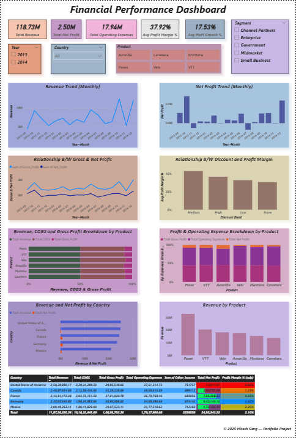
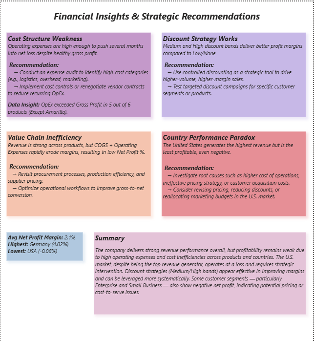

# Financial Performance Dashboard (Power BI)

## 📌 Project Overview
This project analyzes a company's financial performance across products, countries, time periods, and customer segments using Power BI.  
The focus is on identifying profitability challenges, cost inefficiencies, and strategic improvement opportunities.

---

## 📊 Key Metrics Analyzed
- Total Revenue
- Net Profit
- Operating Expenses
- Profit Margin %
- Month-over-Month Growth %
- Year-over-Year Growth %

---

## 📈 Dashboard Highlights
- Revenue and Net Profit trends over time
- Product-level revenue and cost breakdown
- Discount band impact on profit margins
- Country-wise performance comparison
- Identification of loss-making regions and segments

---

## 🔍 Key Business Insights
- **High Operating Expenses** significantly reduce net profit despite healthy gross profit.
- **Medium and High discount bands** outperform low/no-discount strategies in profit margin.
- **Strong revenue does not guarantee profitability** due to COGS and OpEx erosion.
- **United States shows a revenue–profit paradox**, generating the highest revenue but negative net profit.
- Certain customer segments (Enterprise & Small Business) also show negative profitability.

---

## 🎯 Strategic Recommendations
- Optimize high-cost operating expense categories.
- Use controlled discounting as a volume-driven profit lever.
- Improve procurement and operational efficiency.
- Reassess pricing and cost-to-serve strategy in underperforming regions and segments.

---

## 🛠 Tools & Skills Used
- Power BI Desktop
- DAX (Calculated Measures & KPIs)
- Financial Analysis
- Business Insight Storytelling
- Data Visualization & Dashboard Design

---

## 📷 Dashboard Preview

---

© 2025 Hitesh Garg — Portfolio Project
