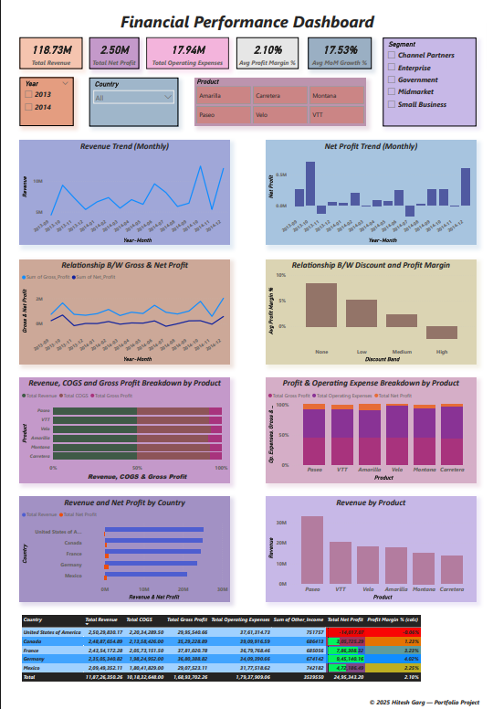
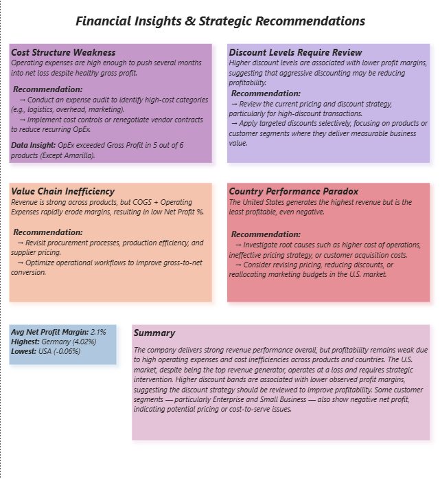

# 💰 Financial Performance Dashboard (Power BI)

## 📌 Project Context
This Power BI dashboard analyzes a company’s financial performance across products, countries, time periods, and customer segments.

The objective is to **diagnose profitability challenges and cost structure risks** — not just report revenue — and support clearer, decision-oriented financial review.

The same dataset was previously analyzed using **Excel and SQL** to ensure metric consistency and analytical validation across tools.

---

## 🎯 Decision Context
This dashboard supports management in:
- Identifying where strong revenue does **not** translate into profit  
- Prioritizing cost-heavy segments, countries, and discount practices  
- Monitoring profitability risk drivers over time  

It is intended for **diagnostic review and monitoring**, not execution or forecasting.

---

## 🚫 Scope & Limitations
- Based entirely on **historical financial data**
- Does **not** perform forecasting, scenario modeling, or prescriptive strategy design
- Insights highlight **risk areas and patterns**, not causal guarantees

---

## 📊 Key Metrics Analyzed
- Total Revenue  
- Net Profit  
- Operating Expenses  
- Profit Margin (%)  
- Month-over-Month Growth (%)  
- Year-over-Year Growth (%)  

---

## 📈 Dashboard Highlights
- Revenue and Net Profit trends over time  
- Product-level revenue and cost breakdown  
- Discount band impact on profit margins  
- Country-wise performance comparison  
- Identification of loss-making regions and customer segments  

---

## 🔍 Analytical Findings
- **High operating expenses** significantly suppress net profit despite healthy revenue
- **Medium and High discount bands** outperform low/no-discount strategies on margin
- **Revenue strength alone is misleading** when COGS and OpEx erosion are ignored
- **United States exhibits a revenue–profit paradox**, leading revenue but generating losses
- Enterprise and Small Business segments show profitability risk despite scale

---

## 🛠 Tools & Skills Used
- Power BI Desktop  
- Power Query  
- DAX (Measures & KPIs)  
- Financial performance analysis  
- Decision-focused dashboard storytelling  

---

## 📷 Dashboard Preview

---

⭐ **Created by Hitesh Garg**  
Finance & Business Data Analyst
